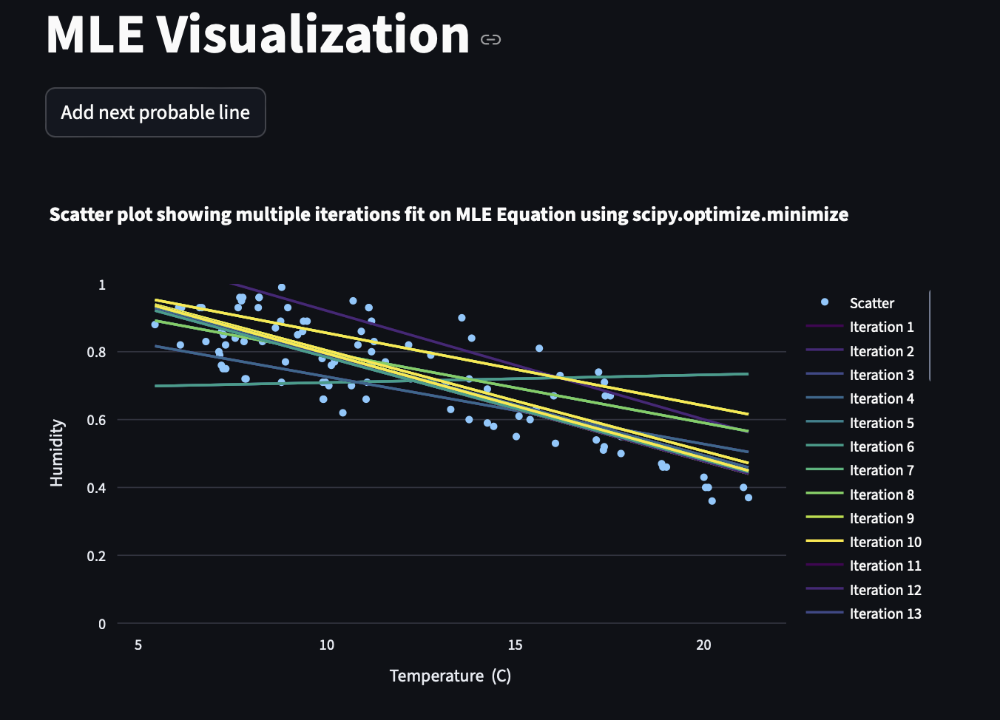
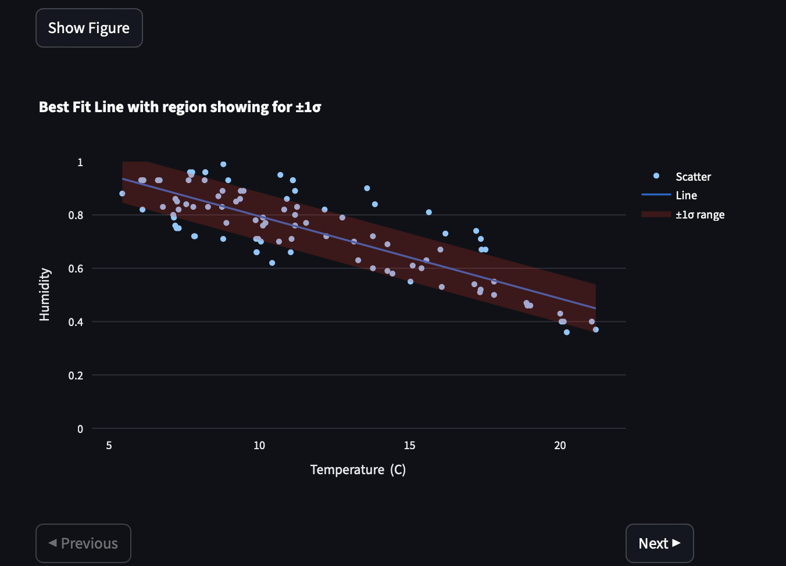
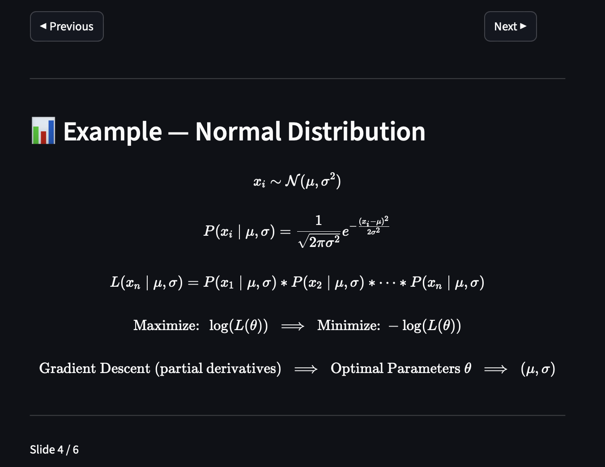

# Understanding Maximum Likelihood Estimations with Estimates and Slides in Streamlit App

- Create Virutal Environment in python `python -m venv env_name`
- Activate the environment and install all the requirements libraries `pip install -r requirements.txt`
- To run the code `streamlit run streamlit_mle.py`
- Weather Data downloaded from KaggleHub. You can comment the download part as it is already available.

## Output Images of the Streamlit App

- Each iteration gives estimation to a probable fit to the dataset

- Best Fit Curve with visualization of data falling in one Standard Deviation Range

- Normal Distribution Intuition Slides

